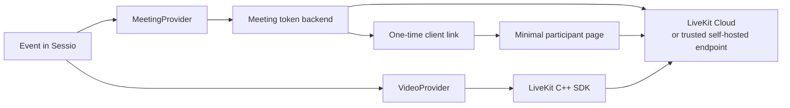
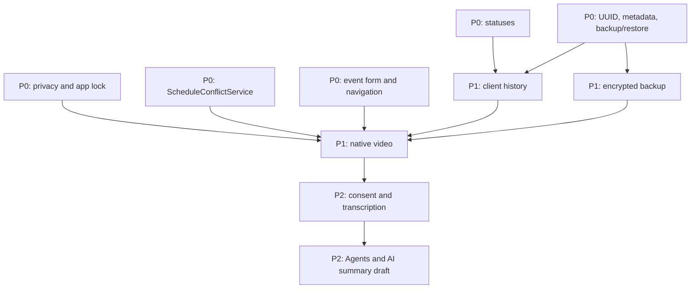

# Sessio — technical roadmap: from closing P0 to native video calls

**Status:** proposal for placement in `docs/`
**Horizon:** closing the current P0 → P1 → P2
**Purpose:** fix the development sequence for the local-first Sessio and the safe addition of embedded video calling via LiveKit Cloud.

## 1. Context and decision-making principle

Sessio remains a desktop application for private practice. Scheduling, the client base, records, local backups, and offline work must not depend on a video provider. Video calling adds value but is not a condition for the app's basic operation.

This roadmap adopts the following rules.

- **Local-first is preserved.** Without VideoSDK configured, the user continues to use events and external `meeting_url` values exactly as now.
- **Workflow first, infrastructure second.** Video calling cannot begin while unfinished P0 scenarios can misrepresent a consultation's status, expose data on a locked screen, or misreport a scheduling conflict.
- **LiveKit is an implementation, not a domain dependency.** An event knows it has a meeting with the selected provider, but does not store LiveKit types, tokens, or secrets.
- **The desktop app never receives the server secret.** The LiveKit API secret exists only in the token backend or in self-hosted deployment infrastructure. It never reaches the application, DuckDB, `.psybackup`, settings, crash reports, or logs.
- **Video does not imply recording or AI.** The first call is audio/video 1:1 only. Recording, transcription, the agent, and AI summaries belong to P2 and are enabled only with separate consent.
- **Readiness is confirmed by real scenarios.** A successful build, unit test, or mock token endpoint does not substitute for a call between two participants on staging and a manual check of the native UI.

## 2. Starting point and priority scope

The public roadmap already covers the calendar, recurring series, external online links, backup/restore, and the foundation of client history. Still in P0 are meeting statuses, private notifications, recurring reminders, `ScheduleConflictService`, UUID/metadata, and verifiable backup/restore. This document considers P0 **nearly closed**, but does not declare any item done without a separate code and UX review.

| Priority | Goal | Outcome |
|---|---|---|
| P0 | Bring the daily workflow to a predictable, private state | correct statuses, app lock, conflicts, and the event form |
| P1-A | Make history and backups a reliable data foundation | unified client history and encrypted backup |
| P1-B | Deliver a secure managed video meeting | LiveKit Cloud, token backend, native Qt UI 1:1 |
| P2 | Add optional session processing | consent, transcription, Agents, and an editable AI draft |

### What "P0 closed" means

P0 is considered closed only once all four conditions are met:

1. Every change listed below has a migration, automated tests, and a manual smoke test for the working calendar scenario.
2. The event form, Timeline, navigation, lock screen, and notification privacy have been visually verified on a supported desktop platform.
3. Recurring events, virtual occurrences, overrides, and exceptions produce no false conflicts and do not change another meeting's status.
4. Production logs, notifications, and the locked window retain no PII, note text, full call URL, token, or key.

## 3. P0 — completing the current product

### P0.1. Meeting statuses and post-consultation actions

**Goal.** Separate the consultation's actual outcome from payment; give the practitioner a fast way to update an event without opening the overloaded editor.

**Scope.**

- Normalize `event_status`: `scheduled`, `confirmed`, `completed`, `rescheduled`, `cancelled_by_client`, `cancelled_by_practitioner`, `no_show`.
- Store `payment_status` separately; a cancelled or no-show meeting must not automatically change payment.
- Add a cancellation reason and an optional comment, plus an explicit rule for how cancellations/no-shows count in analytics.
- Show status and quick actions consistently in the calendar, Timeline, client card, analytics, and the future video session.

**Readiness criteria.** Status is not lost when editing a series; status filter and quick actions are available from the everyday screen; the revenue report does not conflate the fact of holding a session with the fact of payment; all enums have RU/EN translations.

**Dependencies.** Event model, existing recurrence semantics, analytics, and the client history change log.

### P0.2. Privacy and app lock

**Goal.** Prevent accidental exposure of content on lock, sleep, app switching, and system notifications.

**Scope.**

- PIN/password, manual and automatic lock after idle and sleep; optional lock on minimize.
- An opaque overlay over all working content until the unlock dialog is shown; after cancel or successful unlock the user returns to the original screen.
- Three notification modes: full, neutral, and minimal. Neutral is the default.
- Clipboard clearing after copying an invitation, with a configurable delay.
- Production logging audit: do not write name, contacts, notes, diagnoses, tokens, keys, or the full meeting URL.

**Readiness criteria.** No calendar frame or client card is visible under the lock dialog; the PIN is not stored in plain text; desktop notifications do not expose PII under default settings; automated tests cover lock/unlock transitions, and a manual smoke test covers idle, sleep, and cancel.

**Dependencies.** Qt platform events, secure secret storage, and UI on all supported OSes. App lock is not considered encryption of the working database.

### P0.3. `ScheduleConflictService` and warnings in the event form

**Goal.** Produce one explainable decision about a schedule conflict instead of scattered UI checks.

**Scope.**

- Extract `ScheduleConflictService` as the single source of overlap checking.
- Account for regular events, recurring virtual occurrences, overrides, exceptions, personal events, working-hours settings, and future pre/post-consultation buffers.
- Show an inline warning in the form: which events overlap, by how many minutes, and what action is possible — change the time, save deliberately, or cancel.
- Do not treat the event being edited as conflicting with itself; correctly handle the `this and future` split.

**Readiness criteria.** Tests exist for a regular overlap, virtual occurrence, exception, self-edit, and series split; the form, quick slots, and the event create/update API all return the same decision; the warning is visible before saving.

**Dependencies.** P0.1 for statuses and the recurrence model. Buffers and consultation types can be a separate later extension, but the service interface must not require rewriting when they are added.

### P0.4. Event form and navigation polish

**Goal.** Remove the Work/Personal ambiguity, reduce errors when creating a consultation, and surface important fields at the right moment.

**Scope.**

- Split the form into clear sections: time, event type, client and payment, online meeting, recurrence, status.
- Clearly explain the Work/Personal toggle and hide only fields that are genuinely not applicable.
- Preserve context after create/edit/cancel, clean up focus order, labels, and empty/error/save states.
- Simplify the left navigation only as much as needed for calendar, clients, analytics, and settings; do not start a general app redesign.

**Readiness criteria.** A user creates a work and a personal meeting in one pass, sees a conflict before saving, and returns to the expected place after cancelling; manual verification is done with non-empty data, not only on an empty database.

## 4. P1-A — a reliable user foundation

### P1.1. Full client history

**Goal.** The client card becomes the working context of the consultation, not a set of disconnected screens.

**Scope.**

- A single chronological stream: events, statuses, cancellations/reschedules, notes, attachments, payments, and system actions.
- The last held and next scheduled meeting, interval since the last session, presence of a draft and of unpaid balance.
- Editable notes with a draft, revisions, and safe recovery of a previous version.
- Client tasks and tags; attachments with a checksum, file state, and safe soft-delete.

**Readiness criteria.** History is built through a single service, not SQL from the UI; recovering a note revision does not lose the original entry; a lost attachment is visible to the user; P0 actions and statuses appear in history without duplication.

**Dependencies.** Stable UUIDs, metadata/schema migrations, and verified backup/restore. Any history migration starts with a verifiable backup and ends with a fresh-load check.

### P1.2. Encrypted backup

**Goal.** Protect the portable backup with a recovery password, without making cloud storage or encryption of the working database mandatory.

**Scope.**

- A password-protected `.psybackup` with a separate format version, manifest, and authenticated encryption.
- Argon2id-based KDF and cryptography from libsodium; homegrown cryptography is excluded.
- A random master key, encrypted with a key derived from the recovery password; the secret stays in memory only for the duration of the operation.
- Verification of the archive, database, and attachments; restore into a temporary directory before replacing current data; an explicit message that a forgotten recovery password cannot be recovered.
- If automatic local operations are needed — only a key identifier in settings, with the key itself in the system keychain via QtKeychain.

**Readiness criteria.** A ciphertext change is detected; a wrong password does not alter the current database; an encrypted backup restores on another device; tokens, passwords, keys, and decrypted temporary files never reach logs or the backup; there is an automated round-trip test with attachments.

**Dependencies.** P0 backup/restore and schema metadata. Encrypting the working DuckDB and attachments is a separate P2/P3 matter, not a condition for starting video calling.

## 5. P1-B — LiveKit Cloud: managed VideoSDK with native C++/Qt UI

### 5.1. Goal of P1-B and MVP boundary

P1-B gives the practitioner an embedded, Qt-native, one-on-one video session tied to a Sessio event. Media transport and TURN are managed by LiveKit Cloud; Sessio does not implement its own WebRTC/SFU.

The MVP supports exactly:

- one event ↔ one logical video meeting;
- one practitioner and one client at a time;
- microphone, camera, device selection, local preview, remote video, mute/camera toggle, join/leave, and clear connection states;
- inviting the client via a short-lived link to a minimal participant page;
- a native Qt interface for the practitioner, without embedding a third-party web-conferencing UI.

The client-facing participant page is a separate, minimal surface of the token backend: it receives only a one-time invitation, checks devices, and connects to the room. It has no access to the client database, notes, calendar, or analytics. If a different client-facing channel is chosen, it must use the same token-issuance protocol; installing Sessio on the client's side is not required.

### 5.2. Target architecture



Domain objects and persistence do not depend on the SDK.

| Component | Responsibility | Does not do |
|---|---|---|
| `MeetingProvider` | creates/cancels the logical meeting for an event, issues a `MeetingDescriptor`, supports `ExternalUrl` and `LiveKit` | does not capture media and does not know about Qt widgets |
| `VideoProvider` | starts/stops the media session, devices, and call state behind a `VideoSession` interface | does not write tokens or raw media to the database |
| `LiveKitMeetingProvider` | calls the token backend for provisioning/invitation | does not contain the LiveKit API secret |
| `LiveKitVideoProvider` | adapts the LiveKit C++ SDK to Qt signals, capture, and the renderer | does not decide domain consultation statuses |
| Token backend | authenticates the role, issues a short-lived JWT, and manages the invitation lifecycle | does not store notes, clients, diagnoses, or media content |
| Participant page | lets the client check devices and join via a one-time invitation | is not a web version of Sessio |

`Event` stores only the provider kind, an opaque `meeting_ref`, the invitation state, and the usual external `meeting_url` for `ExternalUrl` mode. Access tokens, refresh material, API key, and API secret are never persisted. Room identifiers must be random and must not contain the client's name, date of birth, or consultation topic.

### 5.3. A mandatory technical spike comes first

The LiveKit C++ SDK supports the target desktop platforms, but it accepts raw media frames and does not itself open the camera or microphone. Therefore, before product work begins, an isolated spike is created rather than jumping straight to a feature branch.

The spike must prove, on Linux, Windows, and macOS:

1. building a fixed version of the LiveKit C++ SDK alongside the current CMake/vcpkg environment;
2. camera and microphone capture via Qt Multimedia or a narrow platform adapter without leaking ownership/lifetime;
3. local preview and remote video in a Qt renderer (`QOpenGLWidget` or another chosen native surface) with correct resize behavior;
4. switching camera, microphone, and audio output during an active connection;
5. correct leave/destruction: stopping tracks, cleanup callbacks, releasing devices, and returning to the UI thread;
6. a call between two machines over staging LiveKit Cloud, on both a regular network and one that requires TURN/TLS.

**Decision after the spike.** P1-B proceeds only if these six checks are reproducible and the SDK artifacts can be packaged for Linux/Windows/macOS. A failed spike is not silently replaced with Qt WebEngine: it requires a separate architectural decision — fix the native adapter, restrict the set of supported OSes, or choose a different SDK.

### 5.4. Token backend and access model

Since the LiveKit API secret cannot live in the desktop client, even the MVP needs a small backend. Its data footprint is minimal: provider profile, random `meeting_ref`, invitation hash/expiry, roles, expiration time, and technical audit data without PII.

**Provisioning and join flow.**

1. The practitioner selects `LiveKit` in the event form; `MeetingProvider` creates the logical meeting via the backend.
2. The backend creates a random room name and an invitation with a limited TTL. The physical LiveKit room is created on first connection, so "empty" rooms do not need to be pre-created.
3. The desktop app receives the `meeting_ref` and invitation link, but not the LiveKit secret. The link is copied into the client's invitation.
4. Before joining, the practitioner authenticates the app to the backend; the backend issues only a JWT carrying the practitioner's identity and grants for that room.
5. The client opens the one-time link; after validating the invitation, the backend issues a JWT carrying only the client's identity and grants for the same room.
6. On cancellation/reschedule of the event, the backend invalidates an unused invitation. An active call ends via an explicit participant action or a system disconnect; the event status does not change to `completed` automatically.

The backend must verify that the caller cannot choose an arbitrary room name, role, expiry, or grants. It issues no more than two roles for the MVP and limits participation to one pair. The JWT is short-lived; its duration and refresh mechanism are fixed after the spike, based on the capabilities of the chosen SDK version. During an active call, the token exists only in process memory.

**Minimal API contracts.**

| Endpoint | Caller | Result |
|---|---|---|
| `POST /v1/meetings` | authenticated desktop | `meeting_ref`, secure invitation URL, expiry |
| `POST /v1/meetings/{meeting_ref}/specialist-token` | authenticated desktop, before join | endpoint URL, room name, short-lived JWT, expiry |
| `POST /v1/invitations/{code}/client-token` | participant page | endpoint URL, room name, short-lived JWT, expiry |
| `POST /v1/meetings/{meeting_ref}/invalidate` | authenticated desktop | invalidates an unused invitation |

Desktop authorization to the token backend is a separate technical contract, not a hardcoded API key: for example, a registered device plus a bearer credential in the system keychain. The registration, recovery, and revocation mechanism for credentials must be documented before public launch. The backend and participant page require HTTPS and rate limiting; the invitation code is stored server-side only as a hash.

### 5.5. Native 1:1 UI and session lifecycle

#### States

```text
NoMeeting → Provisioned → PrejoinCheck → Joining → WaitingForClient
        → Connected ↔ Reconnecting → Leaving → Ended
                                   ↘ Failed
```

- `NoMeeting`: the event has no video meeting; the external URL remains available.
- `Provisioned`: a provider and `meeting_ref` exist, but no token has been issued yet.
- `PrejoinCheck`: the user sees the selected camera/microphone/speaker, local preview, and a privacy reminder.
- `Joining`/`WaitingForClient`: requesting the JWT, connecting, clear progress, and a safe cancel button.
- `Connected`: a single remote tile, local picture-in-picture, mute/camera, device selection, a network/reconnecting indicator, and leave.
- `Reconnecting`: the UI does not hide that media is temporarily lost; automatic reconnection is time-limited and ends with an explicit error offering a safe retry.
- `Ended`/`Failed`: tracks are stopped, callbacks unsubscribed, tokens cleared from memory; the event may record a technical outcome `call_joined`/`call_failed`, but media, transcript, or diagnostics containing PII are not recorded.

**MVP UX constraints.** No group rooms, chat, file transfer, screen share, waiting room, recording, live captions, virtual backgrounds, reactions/emoji, or automatic meeting-status changes. Entering the call must not close the client card and must not show notes on a shared/remote surface.

### 5.6. Managed Cloud by default, with a self-host escape hatch

The first production configuration uses LiveKit Cloud because it takes on SFU/TURN, global connectivity, and transport observability. This does not lock the application to a single domain.

- The `ProviderProfile` on the backend holds `provider_kind`, `environment`, `server_url`, and operational credentials; the app receives only a trusted `wss://` endpoint and the issued token.
- The `managed-cloud` profile is the default. Staging and production have separate LiveKit projects, endpoints, and credentials.
- The self-host option is added as a backend-side profile, not as an API key/secret field in Qt settings. It only accepts an HTTPS/WSS endpoint with a trusted-CA certificate and a controlled token backend.
- A self-hosted deployment must have DNS, TLS, correctly opened WebRTC/TURN ports, monitoring, configuration backups, and an on-call owner. The app must not allow a "connect to any URL" toggle without a trusted backend profile.
- Data residency, logging, and retention for Cloud/self-host are fixed in a separate security/privacy note before launching to real clients.

As a result, moving between LiveKit Cloud and a self-run LiveKit server does not change the Event schema, `MeetingProvider`, or the native `VideoProvider`; only the active provider profile on the backend changes, followed by a staging smoke test.

### 5.7. P1-B readiness

P1-B is ready only once all of the following are met:

- the native spike has been successfully reproduced on Linux, Windows, and macOS;
- token backend contract/integration tests forbid room/role/grant escalation and verify invitation expiry/invalidation;
- no tokens, API keys, secrets, or full meeting URLs appear in DuckDB, backups, settings, diagnostic exports, or regular logs;
- automated tests cover `MeetingProvider`, the `VideoSession` state machine, cancelling/rescheduling the event, and safe app shutdown during `Joining`/`Reconnecting`;
- a manual staging smoke test is run with two participants: the practitioner on the native Qt UI, the client via the participant page; camera/mic toggle, device switching, leave, reconnect, and a rejected invitation are all verified;
- a manual privacy test confirms that app lock hides the video window, and that notifications/logging do not expose the client or the room;
- rollback exists: a feature flag disables creating new LiveKit meetings while existing external links and event data remain functional.

## 6. Sequencing and dependencies



| Stage | Preconditions | Distinct outcome |
|---|---|---|
| Closing P0 | existing event/recurrence/backup contracts | predictable and private daily use |
| P1.1 Client history | UUIDs, migrations, backup round-trip | a single, verifiable client context |
| P1.2 Encrypted backup | working backup/restore | a secure portable copy with a recovery password |
| P1-B.0 SDK spike | P0 closed; CMake/vcpkg version fixed | a proven native media pipeline on three OSes |
| P1-B.1 Token backend | backend owner and operating model; LiveKit Cloud staging project | secure issuance of room-scoped JWTs |
| P1-B.2 Provider/domain layer | P1.1 and P1.2; SDK spike | a provider-agnostic meeting lifecycle |
| P1-B.3 Qt video UI | P1-B.1 and P1-B.2 | a verified 1:1 call |
| P2 | P1-B production acceptance and consent | speech processing only as an opt-in draft |

P1-B can be split into independent pull requests, but the order must not change: first the spike and the token backend contract, then the domain adapter, then the UI and real-device acceptance. Each PR preserves the external `meeting_url` fallback.

## 7. P2 — transcription, LiveKit Agents, and AI summary draft

P2 does not start automatically after a successful call. A separate data-governance layer is required first.

### P2.1. Consent and artifact lifecycle

Before any audio processing, the practitioner records explicit, revocable consent and its scope: live transcription, audio/video recording (if ever added), post-call processing, and retention. Consent is tied to a specific session, shows the user the processor/processing location, and can be revoked before processing starts.

Artifacts get a status, source, creation time, retention policy, and a delete action. By default, raw audio/video is not stored. Consent to transcription does not imply consent to recording, model training, or sending data to another service.

### P2.2. Transcription

The first transcription produces an editable draft tied to the event and client; it is not itself a clinical record. Progress, cancel, an error state, speaker attribution only with sufficient confidence, and explicit marking of uncertain segments are required. Before saving, the user can correct or delete the draft.

The engine choice is fixed in a separate ADR: a local pipeline or an explicitly chosen cloud provider. LiveKit transport must not become an implicit recording store. If LiveKit egress/agent is used, retention, access, and deletion are configured before the feature flag is enabled.

### P2.3. LiveKit Agents

The Agent is a separate opt-in participant, not a hidden part of a regular call. In P2 it may receive a permitted audio stream for transcription or a post-call workflow; it does not talk to the client, does not make diagnoses, does not make decisions, and does not send messages without an explicit practitioner action.

The Agent needs a separate environment, credentials, health/metrics, budget/quotas, a versioned prompt, and an audit trail of "which model/version processed the draft" without storing the full sensitive prompt in regular logs. The Agent may be deployed alongside LiveKit Cloud or on controlled infrastructure, but not inside the desktop process.

### P2.4. AI summary draft

The AI receives only explicitly selected sources and produces a **draft**, for example: neutral topics, agreements, tasks for the next meeting, and clarifying questions. It does not formulate a diagnosis, risk assessment, or medical/legal conclusion, and does not modify the client card without manual review.

P2 readiness criteria: consent is verified server-side and in the UI; without it, media never goes to transcription/Agent; the result is editable and deletable; the user sees the origin, model/prompt version, and time; all cloud transfers are observable and documented in the privacy documentation; disabling AI does not break the P1 video call.

## 8. Explicitly out of near-term scope

The following topics are not part of P0, P1-B, or the first P2 cycle:

- a custom WebRTC/SFU, a custom video server instead of LiveKit, and arbitrary SIP/telephony;
- group sessions, clinics, team roles, multi-practitioner workspaces, and shared calendars;
- automatic call recording, hidden transcription, permanent storage of raw media;
- automatic clinical conclusions, diagnoses, risk scoring, sending the summary to the client, or autonomous Agent actions;
- realtime sync of the entire DuckDB, a central patient database, a mandatory account for the base local-first product;
- a public web version of Sessio: the participant page is a narrow technical companion, not the start of a web client;
- arbitrary self-hosted endpoints that a user connects with an API secret from settings;
- replacing the native Qt UI with an embedded web UI without a separate architectural decision.

## 9. Risks and stop conditions

| Risk | Mitigation and stop condition |
|---|---|
| The native C++ SDK does not deliver stable capture/render on three OSes | Do not start product UI before a successful spike; do not mask the problem with a WebView without an explicit decision |
| Leak of a LiveKit secret or JWT | Minting only on the backend; secret scanning, redacted logging, memory-only tokens; an incident blocks rollout |
| The token backend turns into the product's general-purpose backend | Minimal bounded API, no client records/notes; any expansion requires a separate roadmap decision |
| Video calling breaks local-first | External URL fallback, feature flag, and no dependency of calendar/clients on backend availability |
| Unclear consent for speech processing | P2 feature flag stays off until an approved consent/retention policy and UI exist |
| Self-hosting looks cheaper but goes unmaintained | Managed Cloud remains the default; self-hosting is enabled only with a named owner, monitoring, TLS/TURN, and staging acceptance |

## 10. Final sequence

```text
P0: status + privacy/app lock + conflicts + form/navigation polish
        ↓
P1-A: client history
        ↓
P1-A: encrypted backup
        ↓
P1-B.0: native LiveKit C++/Qt spike
        ↓
P1-B.1: token backend + invitation contract
        ↓
P1-B.2: MeetingProvider/VideoProvider + LiveKit Cloud 1:1 UI
        ↓
P2: consent → transcription → LiveKit Agents → reviewed AI summary draft
```

This deliberately places LiveKit ahead of complex sync, a mobile client, and a general AI assistant: an embedded, secure call directly completes an already-existing online-event scenario, while remaining a replaceable integration that does not change Sessio's local-first core.

## 11. Technical sources for the implementation stage

- [LiveKit C++ quickstart](https://docs.livekit.io/transport/sdk-platforms/cpp/) — target desktop platforms, CMake integration, and the SDK's boundary: device capture remains the application's responsibility.
- [LiveKit token endpoint](https://docs.livekit.io/frontends/build/authentication/endpoint/) — the production token endpoint contract and the rule against trusting room/role/grants sent by the client.
- [LiveKit self-hosting overview](https://docs.livekit.io/transport/self-hosting/) and [deployment guide](https://docs.livekit.io/transport/self-hosting/deployment/) — differences between Managed Cloud/self-hosted and TLS/TURN requirements for a self-run endpoint.
