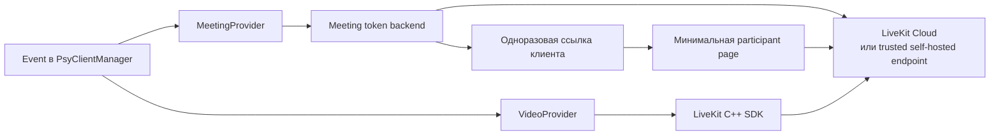
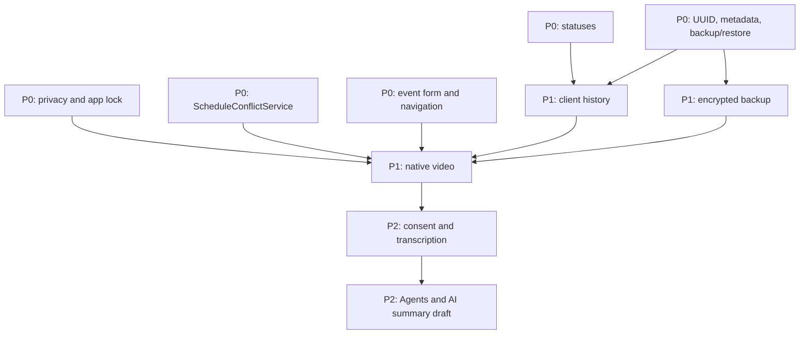

# PsyClientManager — технический roadmap: от закрытия P0 до native-видеосвязи

**Статус:** proposal для размещения в `docs/`  
**Горизонт:** закрытие текущего P0 → P1 → P2  
**Назначение:** зафиксировать последовательность развития local-first PsyClientManager и безопасное добавление встроенной видеосвязи через LiveKit Cloud.

## 1. Контекст и принцип принятия решений

PsyClientManager остаётся desktop-приложением для частной практики. Расписание, клиентская база, записи, локальные backup и работа без интернета не должны зависеть от видеопровайдера. Видеосвязь добавляет ценность, но не является условием базовой работы приложения.

Этот roadmap принимает следующие правила.

- **Local-first сохраняется.** Без настройки VideoSDK пользователь продолжает пользоваться событиями и внешними `meeting_url` как сейчас.
- **Сначала рабочий процесс, затем инфраструктура.** Нельзя начинать видеосвязь, пока незавершённые P0-сценарии могут исказить статус консультации, показать данные на заблокированном экране или неверно сообщить о конфликте в расписании.
- **LiveKit — реализация, не доменная зависимость.** Событие знает, что у него есть встреча выбранного провайдера, но не хранит типы, токены или секреты LiveKit.
- **Desktop не получает server secret.** API secret LiveKit существует только в token backend или в инфраструктуре self-hosted развёртывания. Он никогда не попадает в приложение, DuckDB, `.psybackup`, настройки, crash report или логи.
- **Видео не означает запись или AI.** Первый звонок — только аудио/видео 1:1. Запись, транскрипция, агент и AI-резюме относятся к P2 и включаются только с отдельным согласием.
- **Готовность подтверждается реальными сценариями.** Успешная сборка, unit-тест или мок token endpoint не заменяет звонок двух участников на staging и ручную проверку native UI.

## 2. Исходная точка и рамки приоритетов

В публичном roadmap уже предусмотрены календарь, recurring-серии, внешние online links, backup/restore и основа клиентской истории. В P0 всё ещё находятся статусы встреч, приватные уведомления, recurring reminders, `ScheduleConflictService`, UUID/metadata и проверяемый backup/restore. Этот документ считает P0 **почти закрытым**, но не объявляет каждый пункт готовым без отдельной проверки кода и UX.

| Приоритет | Цель | Результат |
|---|---|---|
| P0 | Довести ежедневный рабочий процесс до предсказуемого и приватного состояния | корректные статусы, app lock, конфликты и форма события |
| P1-A | Сделать историю и резервные копии надёжной основой данных | единая история клиента и encrypted backup |
| P1-B | Провести безопасную managed-видеовстречу | LiveKit Cloud, token backend, native Qt UI 1:1 |
| P2 | Добавить опциональную обработку сессии | consent, транскрипция, Agents и редактируемый AI draft |

### Что означает «P0 закрыт»

P0 считается закрытым только после прохождения всех четырёх условий:

1. Каждое перечисленное ниже изменение имеет миграцию, автоматические тесты и ручной smoke-test для рабочего календарного сценария.
2. Визуально проверены форма события, Timeline, навигация, экран блокировки и notification privacy на поддерживаемой desktop-платформе.
3. Recurring event, virtual occurrence, override и exception не дают ложных конфликтов и не меняют статус другой встречи.
4. В production-логах, уведомлениях и заблокированном окне не остаются PII, текст заметок, полный URL звонка, токен либо ключ.

## 3. P0 — завершение текущего продукта

### P0.1. Статусы встреч и действия после консультации

**Цель.** Разделить фактический исход консультации и оплату; дать специалисту быстрый путь обновить событие, не открывая перегруженный редактор.

**Состав.**

- Нормализовать `event_status`: `scheduled`, `confirmed`, `completed`, `rescheduled`, `cancelled_by_client`, `cancelled_by_practitioner`, `no_show`.
- Хранить `payment_status` отдельно; отменённая или неявившаяся встреча не должна автоматически менять оплату.
- Добавить причину отмены и необязательный комментарий, а также явное правило учёта отмены/неявки в аналитике.
- Показывать статус и быстрые действия одинаково в календаре, Timeline, карточке клиента, аналитике и будущей видеосессии.

**Критерии готовности.** Статус не теряется при редактировании серии; фильтр по статусу и быстрые действия доступны из повседневного экрана; отчёт по доходу не смешивает факт проведения и факт оплаты; все перечисления имеют переводы RU/EN.

**Зависимости.** Модель события, существующая семантика recurrence, аналитика и журнал изменений истории клиента.

### P0.2. Приватность и app lock

**Цель.** Исключить случайный просмотр содержимого при блокировке, sleep, переключении приложения и получении системного уведомления.

**Состав.**

- PIN/пароль, ручная и автоматическая блокировка после idle и sleep; опциональная блокировка при сворачивании.
- Непрозрачный overlay поверх всего рабочего содержимого до отображения unlock dialog; после отмены или успешной разблокировки пользователь возвращается на исходный экран.
- Три режима уведомлений: полный, нейтральный и минимальный. Нейтральный режим — значение по умолчанию.
- Очистка clipboard после копирования приглашения с настраиваемой задержкой.
- Аудит production-логирования: не писать имя, контакты, заметки, диагнозы, токены, ключи и полный meeting URL.

**Критерии готовности.** Нельзя увидеть кадр календаря или карточки клиента под lock dialog; PIN не хранится открытым текстом; desktop notification не раскрывает PII при настройках по умолчанию; автотесты покрывают переходы lock/unlock, а ручной smoke-test — idle, sleep и cancel.

**Зависимости.** Qt platform events, безопасное хранилище секретов и UI на всех поддерживаемых ОС. App lock не считается шифрованием рабочей базы.

### P0.3. `ScheduleConflictService` и предупреждения в форме события

**Цель.** Сделать одно объяснимое решение о конфликте расписания вместо разрозненной проверки в UI.

**Состав.**

- Выделить `ScheduleConflictService` как единственный источник проверки пересечений.
- Учитывать обычные события, recurring virtual occurrences, overrides, exceptions, личные события, настройки рабочих часов и будущие буферы до/после консультации.
- Показывать предупреждение inline в форме: какие события пересекаются, на сколько минут и какое действие возможно — изменить время, сохранить осознанно или отменить.
- Не считать редактируемое событие конфликтом с самим собой; корректно обрабатывать split `this and future`.

**Критерии готовности.** Есть тесты для обычного пересечения, virtual occurrence, exception, self-edit и split серии; одинаковое решение возвращается из формы, quick slots и API создания/изменения события; предупреждение видно до сохранения.

**Зависимости.** P0.1 для статусов и модель recurrence. Буферы и consultation types могут быть отдельным последующим расширением, но интерфейс сервиса не должен требовать переписывания при их добавлении.

### P0.4. Форма события и навигационный polish

**Цель.** Убрать неоднозначность Work/Personal, снизить число ошибок при создании консультации и сделать важные поля видимыми в нужный момент.

**Состав.**

- Разбить форму на ясные секции: время, тип события, клиент и оплата, онлайн-встреча, повторение, статус.
- Чётко объяснить переключатель Work/Personal и скрывать только действительно неприменимые поля.
- Сохранить контекст после create/edit/cancel, привести в порядок focus order, подписи и пустые/error/save states.
- Упростить левую навигацию ровно в объёме, нужном для календаря, клиентов, аналитики и settings; не начинать общий redesign приложения.

**Критерии готовности.** Пользователь за один проход создаёт рабочую и личную встречу, видит конфликт до сохранения и после отмены возвращается в ожидаемое место; ручная проверка проведена с непустыми данными, а не только на пустой базе.

## 4. P1-A — надёжная пользовательская основа

### P1.1. Полная история клиента

**Цель.** Карточка клиента становится рабочим контекстом консультации, а не набором разрозненных экранов.

**Состав.**

- Единый хронологический поток: события, статусы, отмены/переносы, заметки, вложения, оплаты и системные действия.
- Последняя проведённая и следующая запланированная встреча, интервал с последней сессии, наличие черновика и неоплаты.
- Редактируемые заметки с черновиком, revision и безопасным восстановлением предыдущей версии.
- Задачи и теги клиента; вложения с checksum, состоянием файла и безопасным soft-delete.

**Критерии готовности.** История строится через один сервис, а не SQL из UI; восстановление note revision не теряет исходную запись; потерянное вложение видно пользователю; действия и статусы из P0 оказываются в истории без дублирования.

**Зависимости.** Стабильные UUID, metadata/schema migrations и проверенный backup/restore. Любая миграция истории начинается с проверяемого backup и заканчивается fresh-load проверкой.

### P1.2. Encrypted backup

**Цель.** Защитить переносимую резервную копию паролем восстановления, не делая облако или шифрование рабочей базы обязательными.

**Состав.**

- Парольно защищённый `.psybackup` с отдельной версией формата, manifest и authenticated encryption.
- KDF на базе Argon2id и криптография из libsodium; самописная криптография исключена.
- Случайный master key, зашифрованный ключом из recovery password; секрет в памяти ровно на время операции.
- Проверка archive, базы и вложений; restore в временный каталог до замены текущих данных; явное сообщение, что забытый recovery password не восстанавливается.
- При необходимости автоматических локальных операций — только идентификатор ключа в настройках и сам ключ в системном keychain через QtKeychain.

**Критерии готовности.** Изменение ciphertext обнаруживается; неверный пароль не меняет текущую базу; зашифрованный backup восстанавливается на другом устройстве; токены, пароли, ключи и расшифрованные временные файлы не попадают в логи или backup; есть автоматический round-trip test с вложениями.

**Зависимости.** P0 backup/restore и schema metadata. Шифрование рабочей DuckDB и вложений — отдельный P2/P3-решаемый вопрос, не условие начала видеосвязи.

## 5. P1-B — LiveKit Cloud: managed VideoSDK с native C++/Qt UI

### 5.1. Цель P1-B и граница MVP

P1-B даёт специалисту встроенную, нативную для Qt, видеосессию один-на-один, связанную с событием PsyClientManager. Media transport и TURN управляются LiveKit Cloud; PsyClientManager не реализует собственный WebRTC/SFU.

MVP поддерживает ровно:

- одно событие ↔ одна логическая видеовстреча;
- один специалист и один клиент одновременно;
- микрофон, камера, выбор устройств, local preview, remote video, mute/camera toggle, join/leave и понятные состояния соединения;
- приглашение клиенту через короткоживущую ссылку на минимальную participant page;
- нативный Qt-интерфейс для специалиста без встраивания стороннего web-conference UI.

Клиентская participant page — отдельная минимальная поверхность token backend: она получает только одноразовое приглашение, проверяет устройства и соединяется с комнатой. В ней нет доступа к клиентской базе, заметкам, календарю и аналитике. Если выбран иной клиентский канал, он должен обладать тем же протоколом выдачи токена; установить PsyClientManager клиенту не требуется.

### 5.2. Целевая архитектура



Доменные объекты и persistence не зависят от SDK.

| Компонент | Ответственность | Не делает |
|---|---|---|
| `MeetingProvider` | создаёт/отменяет логическую встречу для события, выдаёт `MeetingDescriptor`, поддерживает `ExternalUrl` и `LiveKit` | не захватывает media и не знает Qt widgets |
| `VideoProvider` | запускает/останавливает media session, устройства и состояние звонка за `VideoSession` интерфейсом | не пишет токены или raw media в БД |
| `LiveKitMeetingProvider` | вызывает token backend для provisioning/invitation | не содержит API secret LiveKit |
| `LiveKitVideoProvider` | адаптирует LiveKit C++ SDK к Qt signals, capture и renderer | не решает доменные статусы консультации |
| Token backend | аутентифицирует роль, выдаёт короткоживущий JWT и управляет invitation lifecycle | не хранит заметки, клиентов, диагнозы или media content |
| Participant page | даёт клиенту проверить устройства и войти по одноразовому приглашению | не является web-версией PsyClientManager |

`Event` хранит только provider kind, непрозрачный `meeting_ref`, состояние приглашения и обычный внешний `meeting_url` для режима `ExternalUrl`. Access token, refresh material, API key и API secret не сохраняются. Идентификаторы комнаты должны быть случайными и не содержать имя клиента, дату рождения или тему консультации.

### 5.3. Сначала обязательный технический spike

LiveKit C++ SDK поддерживает целевые desktop-платформы, но принимает raw media frames и сам не открывает камеру или микрофон. Поэтому до product-работы создаётся изолированный spike, а не сразу feature branch.

Spike должен доказать на Linux, Windows и macOS:

1. сборку фиксированной версии LiveKit C++ SDK вместе с текущим CMake/vcpkg окружением;
2. capture камеры и микрофона через Qt Multimedia либо узкий platform adapter без утечки ownership/lifetime;
3. local preview и remote video в Qt renderer (`QOpenGLWidget` или другой выбранный нативный surface) с корректным resize;
4. переключение камеры, микрофона и audio output во время соединения;
5. корректный leave/destruction: остановка tracks, cleanup callback, освобождение devices и возврат в UI thread;
6. звонок между двумя машинами через staging LiveKit Cloud с обычной сетью и сетью, где нужен TURN/TLS.

**Решение после spike.** P1-B продолжается только если эти шесть проверок воспроизводимы и артефакты SDK можно упаковать для Linux/Windows/macOS. Непройденный spike не заменяется молча Qt WebEngine: требуется отдельное архитектурное решение — исправить native adapter, ограничить набор поддерживаемых ОС или выбрать другой SDK.

### 5.4. Token backend и модель доступа

Поскольку API secret LiveKit нельзя положить в desktop-клиент, даже для MVP нужен небольшой backend. Его данные минимальны: provider profile, случайный `meeting_ref`, hash/срок invitation, роли, время истечения и технический audit без PII.

**Поток provisioning и входа.**

1. Специалист в форме события выбирает `LiveKit`; `MeetingProvider` создаёт логическую встречу через backend.
2. Backend создаёт случайное room name и invitation с ограниченным TTL. Физическая LiveKit room появляется при первом подключении, поэтому не требуется заранее создавать «пустые» комнаты.
3. Desktop получает `meeting_ref` и invitation link, но не секрет LiveKit. Ссылка копируется в приглашение клиенту.
4. Перед входом специалист проходит аутентификацию приложения к backend; backend выдаёт только JWT с identity специалиста и grants этого room.
5. Клиент открывает одноразовую ссылку; после проверки invitation backend выдаёт JWT только с identity клиента и grants того же room.
6. По отмене/переносу события backend инвалидирует неиспользованное приглашение. Активный звонок завершается явным действием участника или системным disconnect; состояние события не меняется автоматически на `completed`.

Backend обязан проверять, что caller не выбирает произвольное имя комнаты, роль, срок действия или grants. Он выдаёт не более двух ролей для MVP и ограничивает участие одной парой. JWT короткоживущий; продолжительность и механизм его обновления фиксируются после spike по возможностям выбранной версии SDK. Во время активного звонка токен существует только в памяти процесса.

**Минимальные API-контракты.**

| Endpoint | Кто вызывает | Результат |
|---|---|---|
| `POST /v1/meetings` | authenticated desktop | `meeting_ref`, безопасная invitation URL, expiry |
| `POST /v1/meetings/{meeting_ref}/specialist-token` | authenticated desktop перед join | endpoint URL, room name, short-lived JWT, expiry |
| `POST /v1/invitations/{code}/client-token` | participant page | endpoint URL, room name, short-lived JWT, expiry |
| `POST /v1/meetings/{meeting_ref}/invalidate` | authenticated desktop | инвалидирует неиспользованное invitation |

Авторизация desktop к token backend — отдельный технический контракт, а не зашитый API key: например, зарегистрированное устройство и bearer credential в системном keychain. Способ регистрации, recovery и отзыв credentials должен быть описан до публичного запуска. Backend и participant page требуют HTTPS и rate limiting; invitation code хранится сервером только в виде hash.

### 5.5. Native 1:1 UI и lifecycle сессии

#### Состояния

```text
NoMeeting → Provisioned → PrejoinCheck → Joining → WaitingForClient
        → Connected ↔ Reconnecting → Leaving → Ended
                                   ↘ Failed
```

- `NoMeeting`: у события нет видеовстречи; остаётся доступным внешний URL.
- `Provisioned`: есть provider и `meeting_ref`, но токен ещё не выдавался.
- `PrejoinCheck`: пользователь видит выбранные camera/microphone/speaker, local preview и privacy reminder.
- `Joining`/`WaitingForClient`: запрос JWT, подключение, понятный progress и безопасная кнопка отмены.
- `Connected`: один remote tile, local picture-in-picture, mute/camera, выбор устройств, индикатор network/reconnecting и leave.
- `Reconnecting`: UI не скрывает, что media временно потеряно; автоматическое переподключение ограничено по времени и завершается явной ошибкой с безопасной возможностью retry.
- `Ended`/`Failed`: tracks остановлены, callback отписаны, токены очищены из памяти; в событие может быть записан технический итог `call_joined`/`call_failed`, но не записываются media, transcript или диагностика с PII.

**UX-ограничения MVP.** Нет групповых комнат, chat, file transfer, screen share, waiting room, записи, live captions, виртуальных фонов, реакции/emoji и автоматической смены статуса встречи. Переход к звонку не должен закрывать карточку клиента и не должен показывать заметки на shared/remote surface.

### 5.6. Managed Cloud по умолчанию и self-host escape hatch

Первая production-конфигурация использует LiveKit Cloud, потому что она берёт на себя SFU/TURN, глобальную связность и наблюдаемость transport. Это не делает приложение привязанным к одному домену.

- `ProviderProfile` в backend содержит `provider_kind`, `environment`, `server_url` и операционные credentials; приложение получает только trusted `wss://` endpoint и выданный токен.
- Profile `managed-cloud` используется по умолчанию. Staging и production имеют разные LiveKit projects, endpoint и credentials.
- Self-host option добавляется как profile на стороне backend, а не как поле для API key/secret в Qt settings. Он принимает только HTTPS/WSS endpoint с сертификатом от trusted CA и контролируемый token backend.
- Self-host deployment обязан иметь DNS, TLS, корректно открытые WebRTC/TURN порты, monitoring, backup конфигурации и owner on-call. В приложении не допускается переключатель «подключиться к любому URL» без доверенного backend profile.
- Data residency, журналирование и retention Cloud/self-host фиксируются в отдельной security/privacy note до запуска для реальных клиентов.

Таким образом, перенос между LiveKit Cloud и собственным LiveKit server не меняет Event schema, `MeetingProvider` или native `VideoProvider`; меняется активный provider profile в backend и проходит staging smoke-test.

### 5.7. Готовность P1-B

P1-B готов только если выполнены все пункты:

- native spike успешно повторён на Linux, Windows и macOS;
- contract/integration tests token backend запрещают room/role/grant escalation и проверяют expiry/invalidation invitation;
- нет токенов, API keys, secrets и полного meeting URL в DuckDB, backup, settings, diagnostic export или обычном логе;
- automated tests покрывают `MeetingProvider`, state machine `VideoSession`, отмену/перенос события и безопасное закрытие приложения во время `Joining`/`Reconnecting`;
- ручной staging smoke-test проводится двумя участниками: специалист в native Qt UI, клиент через participant page; проверены camera/mic toggle, device switch, leave, reconnect и rejected invitation;
- manual privacy test подтверждает, что app lock скрывает videowindow, а notification/logging не раскрывают клиента или комнату;
- есть rollback: feature flag выключает создание новых LiveKit-встреч, а существующие external links и данные событий остаются работоспособными.

## 6. Последовательность и зависимости



| Этап | Предусловия | Отдельный результат |
|---|---|---|
| Закрытие P0 | существующие event/recurrence/backup контракты | предсказуемое и приватное ежедневное использование |
| P1.1 Client history | UUID, migrations, backup round-trip | единый проверяемый контекст клиента |
| P1.2 Encrypted backup | готовый backup/restore | безопасная переносимая копия с recovery password |
| P1-B.0 SDK spike | P0 закрыт; версия CMake/vcpkg зафиксирована | доказанная native media цепочка на трёх ОС |
| P1-B.1 Token backend | owner и операционная модель backend; LiveKit Cloud staging project | безопасная выдача room-scoped JWT |
| P1-B.2 Provider/domain layer | P1.1 и P1.2; SDK spike | provider-agnostic meeting lifecycle |
| P1-B.3 Qt video UI | P1-B.1 и P1-B.2 | проверенный звонок 1:1 |
| P2 | P1-B production acceptance и согласие | обработка речи только как opt-in draft |

P1-B может быть разделён на независимые pull requests, но не должен менять порядок: сначала spike и token backend contract, затем domain adapter, затем UI и real-device acceptance. В каждом PR сохраняется external `meeting_url` fallback.

## 7. P2 — транскрипция, LiveKit Agents и AI summary draft

P2 не начинается автоматически с успешного звонка. Сначала нужен отдельный data-governance слой.

### P2.1. Consent и жизненный цикл артефактов

Перед любой обработкой аудио специалист фиксирует явное, отзываемое согласие и scope: live transcription, запись аудио/видео (если когда-либо будет добавлена), post-call processing и retention. Согласие привязывается к конкретной сессии, показывает пользователю обработчика/место обработки и может быть отозвано до запуска.

Артефакты получают status, источник, время создания, policy retention и действие удаления. По умолчанию raw audio/video не сохраняются. Согласие на транскрипцию не означает согласие на запись, обучение модели или отправку данных в другой сервис.

### P2.2. Transcription

Первая транскрипция создаёт редактируемый draft, привязанный к событию и клиенту; она не является клинической записью сама по себе. Необходимы progress, cancel, error state, speaker attribution только при достаточной уверенности и явная маркировка неизвестных участков. До сохранения пользователь может исправить или удалить draft.

Выбор движка фиксируется отдельным ADR: локальный pipeline либо явно выбранный cloud provider. LiveKit transport не должен становиться неявным хранением recording. Если используется LiveKit egress/agent, retention, доступ и удаление конфигурируются до включения feature flag.

### P2.3. LiveKit Agents

Agent — отдельный opt-in participant, а не скрытая часть обычного звонка. В P2 он может получать разрешённый audio stream для транскрипции или post-call workflow; он не говорит с клиентом, не ставит диагнозы, не принимает решения и не отправляет сообщения без явного действия специалиста.

Для Agent нужны отдельное окружение, credentials, health/metrics, budget/quotas, versioned prompt и audit «какая модель/версия обработала черновик» без сохранения полного чувствительного prompt в обычных логах. Agent может разворачиваться рядом с LiveKit Cloud или на контролируемой инфраструктуре, но не в desktop-процессе.

### P2.4. AI summary draft

AI получает только явно выбранные источники и создаёт **черновик**, например: нейтральные темы, договорённости, задачи к следующей встрече и вопросы на уточнение. Он не формулирует диагноз, оценку риска, медицинское/правовое заключение и не изменяет карточку клиента без ручного review.

Критерии готовности P2: consent проверяется сервером и UI; без него media не уходит в transcription/Agent; результат редактируем и удаляем; пользователь видит origin, model/prompt version и время; все cloud transfers наблюдаемы и описаны в privacy documentation; отключение AI не нарушает P1-видеозвонок.

## 8. Явно вне ближайшего scope

Следующие темы не входят в P0, P1-B и первый P2-цикл:

- собственный WebRTC/SFU, собственный видеосервер вместо LiveKit и произвольные SIP/телефония;
- групповые сессии, клиники, роли команды, multi-practitioner workspaces и shared calendars;
- автоматическая запись звонков, скрытая транскрипция, постоянное хранение raw media;
- автоматические clinical conclusions, диагнозы, risk scoring, отправка summary клиенту или самостоятельные действия Agent;
- realtime sync всей DuckDB, центральная база пациентов, обязательный аккаунт для базового local-first продукта;
- публичная web-версия PsyClientManager: participant page — узкий технический companion, а не начало web-клиента;
- произвольные self-host endpoint, которые пользователь подключает с API secret из settings;
- замена native Qt UI на embedded web UI без отдельного архитектурного решения.

## 9. Риски и стоп-условия

| Риск | Профилактика и stop condition |
|---|---|
| Native C++ SDK не даёт стабильный capture/render на трёх ОС | Не начинать product UI до успешного spike; не маскировать проблему WebView без явного решения |
| Утечка LiveKit secret или JWT | Только backend minting; secret scan, redacted logging, memory-only tokens; инцидент блокирует rollout |
| Token backend превращается в общий backend продукта | Минимальный bounded API, без client records/notes; любое расширение требует отдельного roadmap решения |
| Видеосвязь ломает local-first | Внешний URL fallback, feature flag и отсутствие зависимости календаря/клиентов от backend availability |
| Неопределённое согласие на обработку речи | P2 feature flag выключен до утверждённой consent/retention policy и UI |
| Self-host выглядит дешевле, но не обслуживается | Managed Cloud остаётся default; self-host включается только с named owner, monitoring, TLS/TURN и staging acceptance |

## 10. Итоговая последовательность

```text
P0: status + privacy/app lock + conflicts + form/navigation polish
        ↓
P1-A: client history
        ↓
P1-A: encrypted backup
        ↓
P1-B.0: native LiveKit C++/Qt spike
        ↓
P1-B.1: token backend + invitation contract
        ↓
P1-B.2: MeetingProvider/VideoProvider + LiveKit Cloud 1:1 UI
        ↓
P2: consent → transcription → LiveKit Agents → reviewed AI summary draft
```

Это намеренно ставит LiveKit выше сложной синхронизации, мобильного клиента и общего AI-ассистента: встроенный защищённый звонок напрямую завершает уже существующий сценарий online event, но остаётся заменяемой интеграцией и не меняет local-first ядро PsyClientManager.

## 11. Технические источники для этапа реализации

- [LiveKit C++ quickstart](https://docs.livekit.io/transport/sdk-platforms/cpp/) — целевые desktop-платформы, CMake-подключение и ограничение SDK: capture устройств остаётся задачей приложения.
- [LiveKit token endpoint](https://docs.livekit.io/frontends/build/authentication/endpoint/) — контракт production token endpoint и запрет доверять room/role/grants, присланным клиентом.
- [LiveKit self-hosting overview](https://docs.livekit.io/transport/self-hosting/) и [deployment guide](https://docs.livekit.io/transport/self-hosting/deployment/) — различия Managed Cloud/self-hosted и требования TLS/TURN для своего endpoint.
